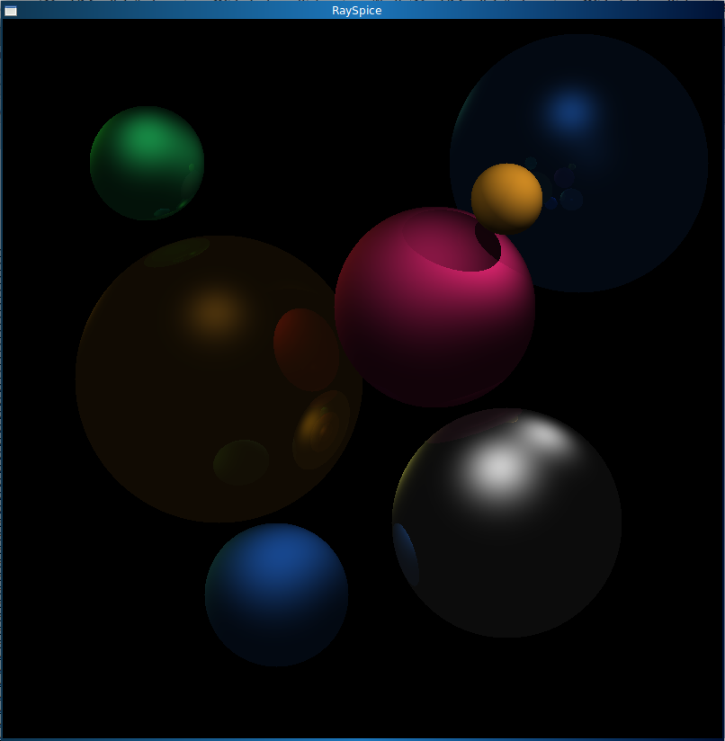

# RaySpice

After ~30 years coding, finally wrote my first raytracer.

Lightning fast! Generate the following high-res picture in less than three seconds with 4 cores!! It uses heavily the parallel computing features of Julia.

This is about 4 hours work, 200 lines of code with minimal library use.

Hmm, I know. It has only spheres...

